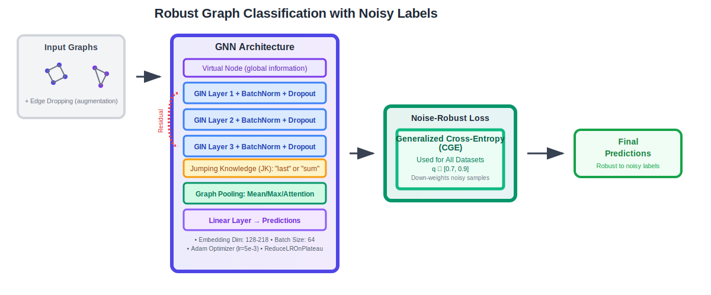

# HACKATON

## Pipeline Overview

## Approach

This repository contains the final submission for the Deep Learning Hackathon (Sapienza University, MSc in Artificial Intelligence and Robotics). It details our approach to graph classification in the presence of noisy labels.
Starting from the baseline structure, our solution builds upon a GNN architecture centered around Graph Isomorphism Network (GIN) convolutions.

### Key Techniques for Robustness

To enhance model performance, stability, and robustness to the noisy dataset, we incorporated several techniques:

- **Batch Normalization**: Applied after GIN layers and optionally before graph pooling to stabilize training dynamics
- **Dropout**: Utilized with relatively high probabilities on node embeddings to mitigate overfitting, especially given the noisy labels
- **Residual Connections**: To facilitate easier training of deeper GNNs by improving gradient flow
- **Jumping Knowledge (JK) Connections**: Configured as "last" or "sum" to effectively aggregate information from different depths of the GNN
- **Virtual Node**: Integrated to enhance global information propagation across each graph, allowing the model to learn more comprehensive graph representations
- **Edge Dropping**: Employed during training as a form of data augmentation and regularization, encouraging the network to learn more robust features by randomly removing edges

### Loss Function Strategy

A critical aspect of our approach was the selection of a loss function tailored to handle label noise. Our empirical evaluations led to using Generalized Cross-Entropy (GCE) loss (with q values typically around 0.7-0.9), which yielded superior performance. GCE is known for its robustness to noise by down-weighting the contribution of potentially mislabeled samples with high loss.

### Hyperparameters

While specific hyperparameter configurations varied slightly per dataset to optimize performance, several common settings emerged:

- **Network Depth**: 2 to 3 GIN layers
- **Embedding Dimension**: Ranged from 128 to 218
- **Batch Size**: Consistently set to 64
- **Optimizer & Learning Rate**: Adam optimizer with an initial learning rate of 5e-3, managed by a ReduceLROnPlateau learning rate scheduler to adjust learning based on validation performance

## Repository Structure

- `main.py`: Main entry point for training and testing
- `source/baselinedeep_updated.py`: Implements GCE and other standard baselines
- `source/models_EDandBatch_norm.py`: Defines the core GNN architecture
- `source/conv.py`: Contains GIN/GCN convolution layer implementations

## Reference to notebooks
real baseline was beaten using notebooks in these links
- https://www.kaggle.com/code/lbarbieri/baselinedeep/
- https://www.kaggle.com/code/lbarbieri/gcodio/
